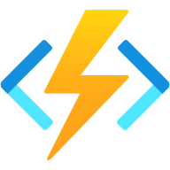

# Debuggning av Azure Functions

#### Förberedelser

Följ intruktionerna nedan för det operativ system du använder.

<strong>Windows</strong>

1. Ladda ned .NET Core 3.1 SDK här [64-bitars-installationfil] (https://dotnet.microsoft.com/download/dotnet/thank-you/sdk-3.1.408-windows-x64-installer)
2. Installera VS Code (Visual Studio Code) [länk] (https://code.visualstudio.com/Download#)
3. Installera Azure Functions Core Tools [64-bitars-installationsfil] (https://go.microsoft.com/fwlink/?linkid=2135274)

<strong>macOS</strong>

1. Ladda ned .NET Core 3.1 SDK här [installationsfil] (https://dotnet.microsoft.com/download/dotnet/thank-you/sdk-3.1.408-macos-x64-installer)
2. Installera VS Code (Visual Studio Code) [länk] (https://code.visualstudio.com/Download#)
3. Installera Azure Functions Core Tools [länk-till-dokumentation] (https://docs.microsoft.com/en-us/azure/azure-functions/functions-run-local?tabs=macos%2Ccsharp%2Cbash#install-the-azure-functions-core-tools)

<strong>Linux</strong>

1. Följ denna [guide] (https://docs.microsoft.com/sv-se/dotnet/core/install/linux) för att ladda ned .NET Core 3.1 SDK 
2. Installera VS Code (Visual Studio Code) [länk] (https://code.visualstudio.com/Download#)
3. Installera Azure Functions Core Tools [länk-till-dokumentation] (https://docs.microsoft.com/en-us/azure/azure-functions/functions-run-local?tabs=linux%2Ccsharp%2Cbash#install-the-azure-functions-core-tools)

#### Fastnat?

Pinga i chatten eller ställ din fråga direkt i mötet.

