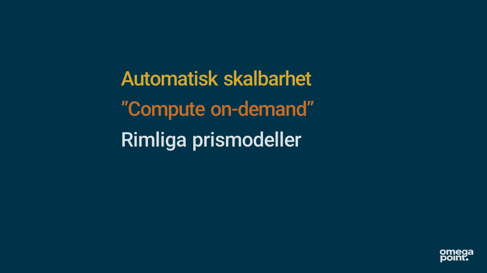
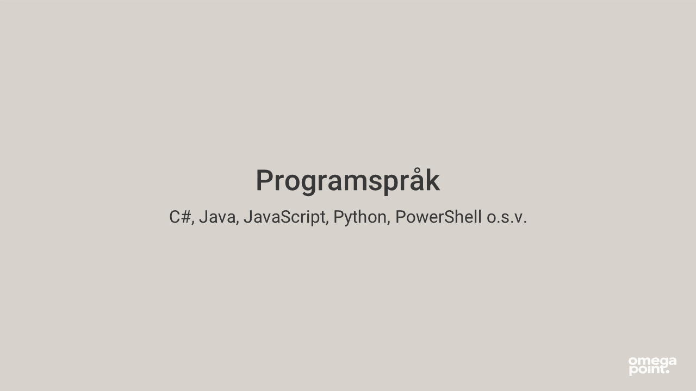
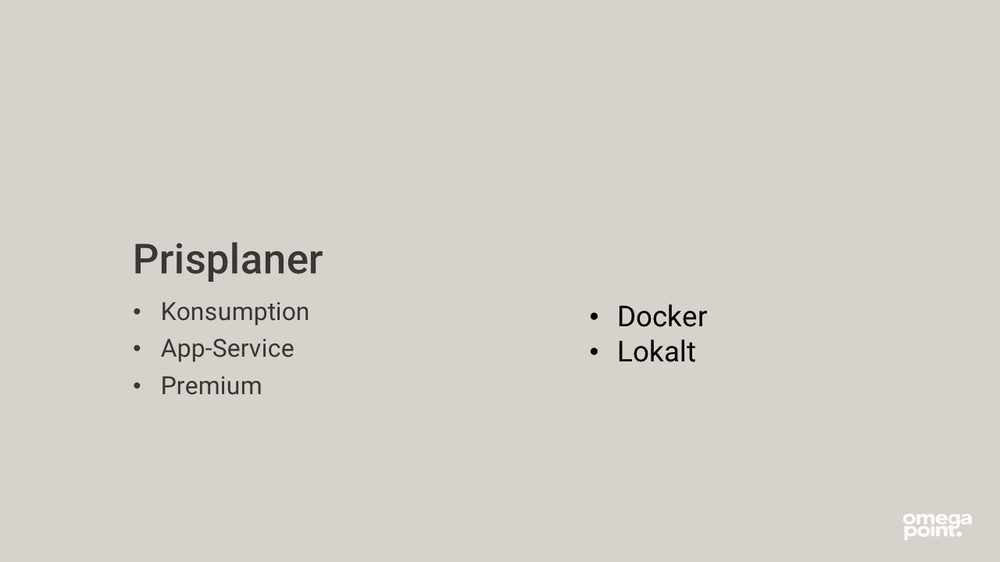
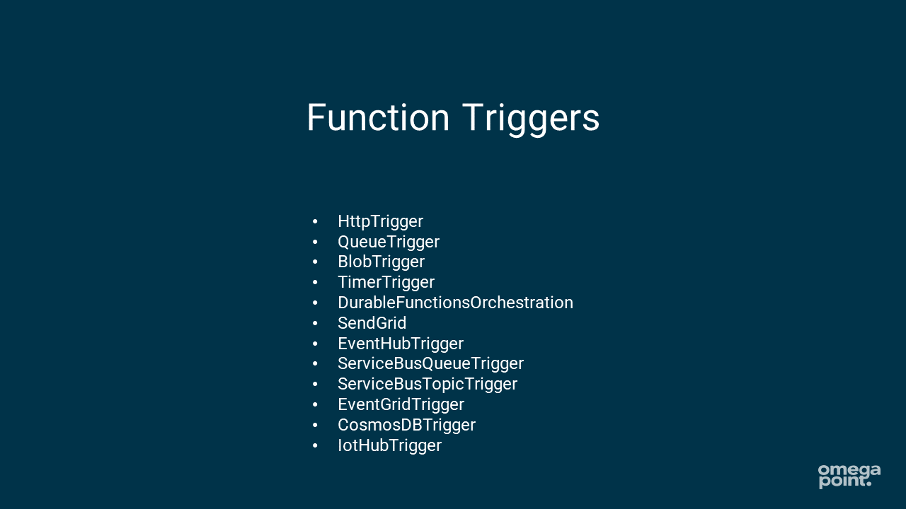
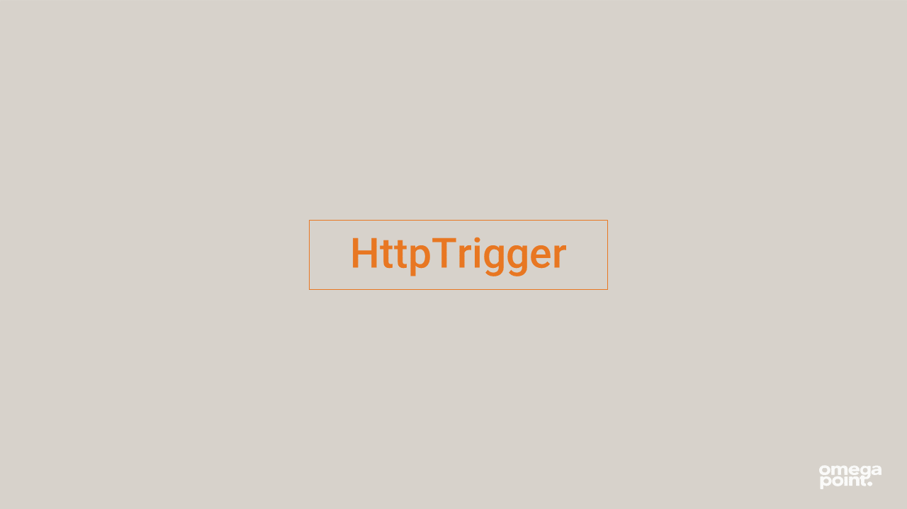
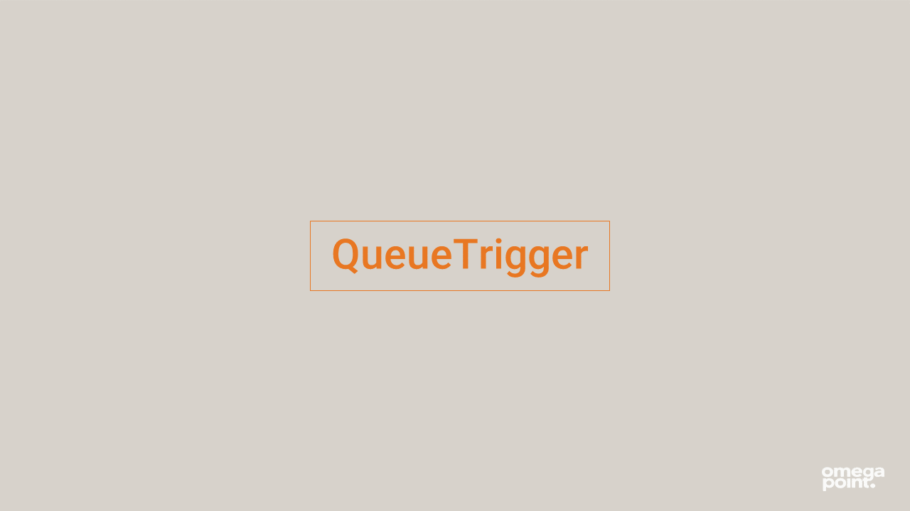
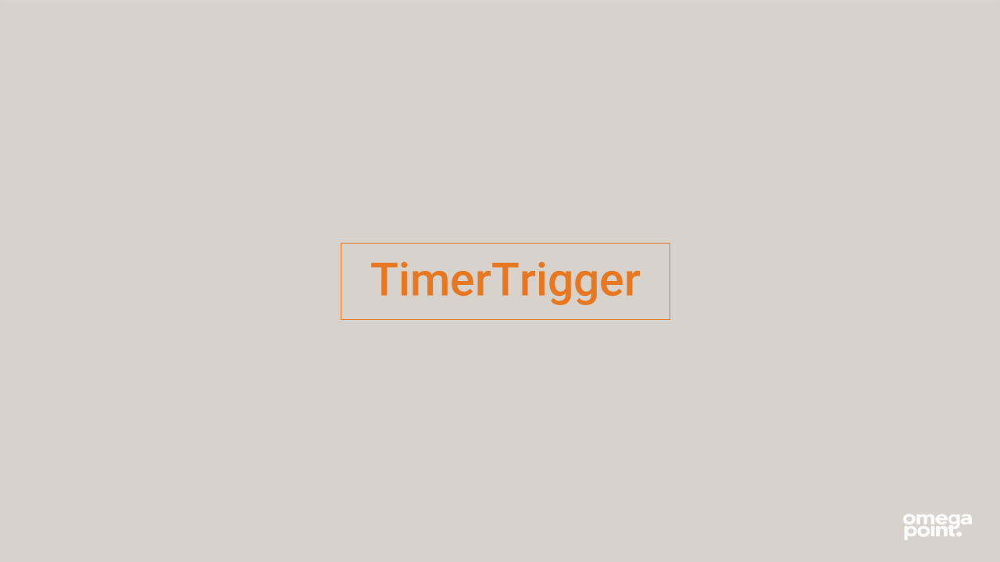

# Debuggning av Azure Functions


## Förberedelser

Följ intruktionerna nedan för det operativsystem du använder.


<details><summary><strong>Windows</strong></summary>
<p>

1. Ladda ned .NET Core 3.1 SDK här [64-bitars-installationsfil](https://dotnet.microsoft.com/download/dotnet/thank-you/sdk-3.1.408-windows-x64-installer)
2. Installera Azure Functions Core Tools [64-bitars-installationsfil](https://go.microsoft.com/fwlink/?linkid=2135274)
3. Installera VS Code (Visual Studio Code) [länk](https://code.visualstudio.com/Download#)
4. Installera Azurite Extension till VSCode [Azurite](vscode:extension/Azurite.azurite)

Skapa en mapp i C:\ eller liknande som heter `azurite`
Ändra location inställningen in Azurite Extension till att peka på din mapp.
Se nedan gif hur du gör det.


</p>
</details>

<details><summary><strong>macOS</strong></summary>
<p>

1. Ladda ned .NET Core 3.1 SDK här [installationsfil](https://dotnet.microsoft.com/download/dotnet/thank-you/sdk-3.1.408-macos-x64-installer)
2. Installera Azure Functions Core Tools [länk-till-dokumentation](https://docs.microsoft.com/en-us/azure/azure-functions/functions-run-local?tabs=macos%2Ccsharp%2Cbash#install-the-azure-functions-core-tools)
3. Installera VS Code (Visual Studio Code) [länk](https://code.visualstudio.com/Download#)
4. Installera Azurite Extension till VSCode [Azurite](vscode:extension/Azurite.azurite)

Skapa en mapp i C:\ eller liknande som heter `azurite`
Ändra location inställningen in Azurite Extension till att peka på din mapp.
Se nedan gif hur du gör det.


</p>
</details>

<details><summary><strong>Linux</strong></summary>
<p>

1. Följ denna [guide](https://docs.microsoft.com/sv-se/dotnet/core/install/linux) för att ladda ned .NET Core 3.1 SDK 
2. Installera Azure Functions Core Tools [länk-till-dokumentation](https://docs.microsoft.com/en-us/azure/azure-functions/functions-run-local?tabs=linux%2Ccsharp%2Cbash#install-the-azure-functions-core-tools)
3. Installera VS Code (Visual Studio Code) [länk](https://code.visualstudio.com/Download#)
4. Installera Azurite Extension till VSCode [Azurite](vscode:extension/Azurite.azurite)

Skapa en mapp i C:\ eller liknande som heter `azurite`
Ändra location inställningen in Azurite Extension till att peka på din mapp.
Se nedan gif hur du gör det. 


</p>
</details>

## Skapa en funktionsapp

<details><summary><strong>Kommandon</strong></summary>
<p>

Se till att ha dotnet 3.0 eller senare installerat
```
$ dotnet --version
```

Kolla också att det gick bra att installera Azure Functions Core Tools
```
$ func --version
```

Skapa en mapp som till exempel heter `Functions` eller gå till en valfri mapp och skriv `mkdir Functions`

Hoppa in i den mappen

```
$ cd .\Functions\
```

## Här börjar vi skapa funktionsappen 


```
$ func init
```
*`Func init` skapar en ny funktionsapp*

Öppna i VSCode (Visual Studio Code) 

*för att debuggern ska fungera kräver det att man öppnar upp mappen i VSCode där functionen ligger*

```
$ code .
```
*`code .` öppnar upp mappen du befinner dig i, i VSCode*

Skapa en Funktion!

```
$ func new
```
*`func new` skapar en ny funktionstrigger*

Välj `HttpTrigger` i listan och namnge triggern vad du vill

Ändra `Route = null` i in-parametern till funktionen till `Route = "names"`

Tryck `F5` på tangentbordet när du är i VSCode för att starta funtionsappen i debug-läge.

Kör följande kommando utan debugger
```
$ func host start
```
*`func host start` startar funktionsappen*

Öppna förslagsvis upp ett nytt fönster av din kommandotolk och gör en post request till din nyss skapade HttpTrigger!

#### Windows

```
$ curl.exe --request POST http://localhost:7071/api/names --data "{'name':'there!'}"
```

#### Linux och macOS

```
$ curl -X POST -H "Content-Type: application/json" \-d '{"name":"there!"}' \http://localhost:7071/api/names
```

</p>
</details>

Börja debugga!

## Presentation

<details><summary><strong>Slides</strong></summary>
<p>

<br>

















</p>
</details>

## Fastnat?

Pinga i chatten eller ställ din fråga direkt i mötet.

